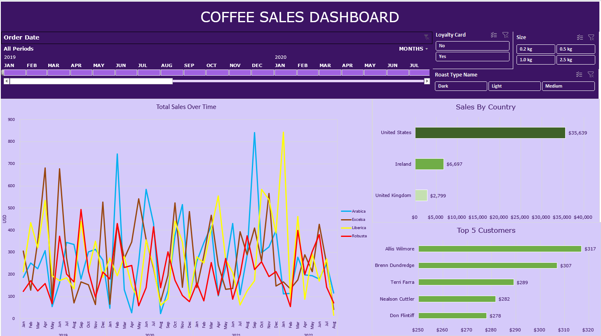
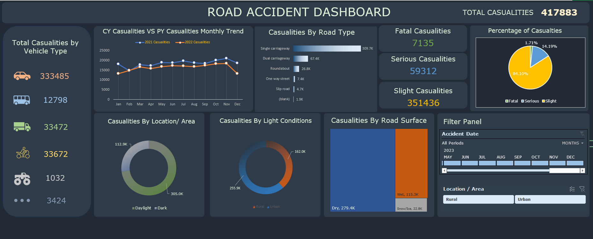
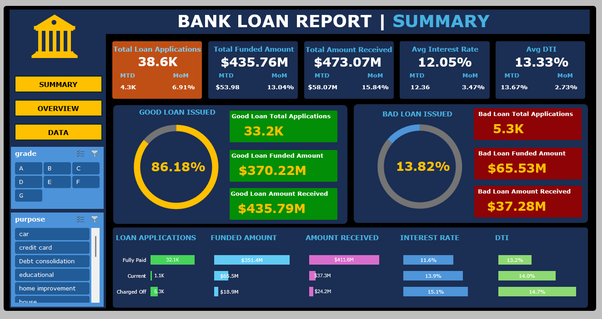
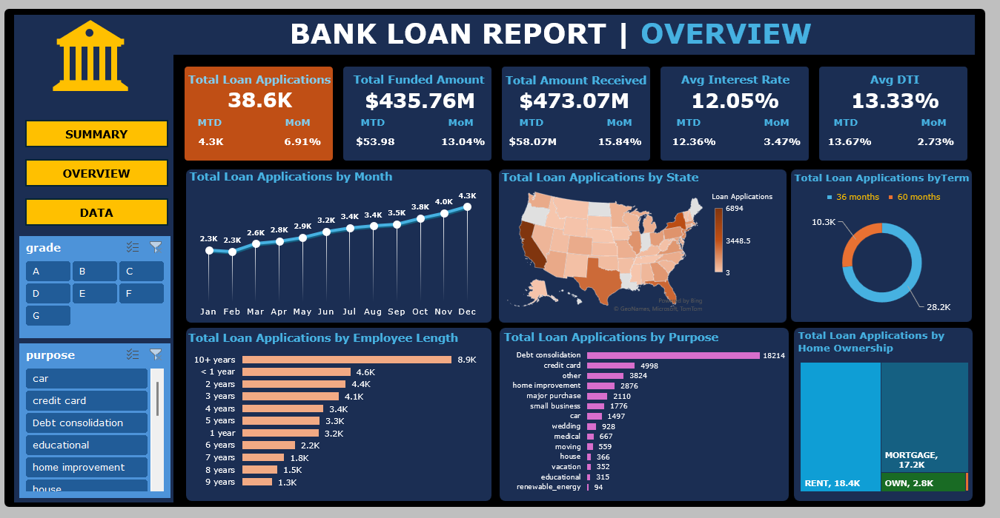

# Projects in Microsoft Excel

---

### Table of Contents

- [Projects](#projects)
- [License](#license)
- [Author Info](#author-info)

---

## Projects

This repository contains my data analysis projects which I have worked using Microsoft Excel.

### [Coffee Sales Dashboard](coffee-orders/CoffeeOrdersData.xlsx)

#### Objective

- Analyze global coffee sales data, identify sales trends based on coffee orders, customers and coffee products.
- Track Sales trends over time.
- Identify Sales data by country.
- Get insights into sales data based on top customers.
- Filter sales data based on Coffee Roast type, membership data.

#### Key Tasks

- Perform data cleaning, data transformation on the coffee orders, customers and products tables.
- Ensure all columns represented correct data types.
- Merge data from multiple tables with the help of **Excel functions like XLOOKUP, INDEX, MATCH**.
- Identified key trends with the help of Pivot Tables.
- Analyzed data with the help of Charts, Filters and Slicers.

#### Outcome

### [Road Accidents Dashboard](road-accidents/RoadAccidentData.xlsx)

#### Objective

- **Primary KPI's**
    - Total Casualities taken place after the accident.
    - Total Casualities & percentage of total with respect to accident severity and maximum casualities by type of vehicle.
- **Secondary KPI's**
    - Total Casualities with respect to vehicle type
    - Monthly trend showing comparison of casualities for current year and previous year.
    - Maximum Casualities by Road Type.
    - Distribution of total casualities by Road Surface.
    - Relation between casualities by Area/Location and by Day/ Night.

#### Key Tasks

- Perform data cleaning, data transformation on the road accident data.
- Ensure all columns represented correct data types.
- Created appropriate charts to analyze key trends based on the business requirements.
- Designed a visually appealing dashboard highlighting KPI's and proper charts.

#### Outcome

### [Bank Loans Dashboard](bank-loans/BankLoanData.xlsx)

#### Objective

- **Key Performance Indicators (KPIs)**
    - Total Loan Applications
    - Total Funded Amount (the amount of funds disbursed as loans)
    - Total Loan Amount Received (the amount received from borrowers)
    - Average Interest Rate
    - Average Debt-to-Income (DTI) Ratio

#### Key Tasks

- Perform data cleaning, data transformation on the bank loan data.
- Ensure all columns represented correct data types.
- Created appropriate charts to analyze key trends based on the business requirements.
- Designed a visually appealing dashboard highlighting KPI's and proper charts.

#### Outcome

[Back to the Top](#projects-in-microsoft-excel)

---

## License

MIT License

Copyright (c) [2024] [Prasanna Sriram]

Permission is hereby granted, free of charge, to any person obtaining a copy
of this software and associated documentation files (the "Software"), to deal
in the Software without restriction, including without limitation the rights
to use, copy, modify, merge, publish, distribute, sublicense, and/or sell
copies of the Software, and to permit persons to whom the Software is
furnished to do so, subject to the following conditions:

The above copyright notice and this permission notice shall be included in all
copies or substantial portions of the Software.

THE SOFTWARE IS PROVIDED "AS IS", WITHOUT WARRANTY OF ANY KIND, EXPRESS OR
IMPLIED, INCLUDING BUT NOT LIMITED TO THE WARRANTIES OF MERCHANTABILITY,
FITNESS FOR A PARTICULAR PURPOSE AND NONINFRINGEMENT. IN NO EVENT SHALL THE
AUTHORS OR COPYRIGHT HOLDERS BE LIABLE FOR ANY CLAIM, DAMAGES OR OTHER
LIABILITY, WHETHER IN AN ACTION OF CONTRACT, TORT OR OTHERWISE, ARISING FROM,
OUT OF OR IN CONNECTION WITH THE SOFTWARE OR THE USE OR OTHER DEALINGS IN THE
SOFTWARE.

[Back to the Top](#projects-in-microsoft-excel)

---

## Author Info

- Github - [pras306](https://github.com/pras306)
- LinkedIn - [Prasanna Sriram](https://www.linkedin.com/in/prasanna-sriram/)

[Back to the Top](#projects-in-microsoft-excel)