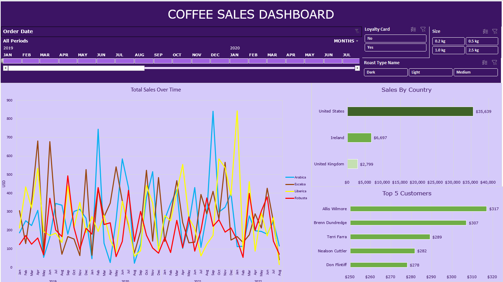

# Coffee Sales Analysis 

---

### Table of Contents

- [Objective](#objective)
- [Technologies](#technologies)
- [Project Files](#project-files)
- [Project Outcome](#project-outcome)
- [License](#license)
- [Author Info](#author-info)

---

## Objective

- Analyze global coffee sales data, identify sales trends based on coffee orders, customers and coffee products.
- Track Sales trends over time.
- Identify Sales data by country.
- Get insights into sales data based on top customers.
- Filter sales data based on Coffee Roast type, membership data.

[Back to the Top](#coffee-sales-analysis)

---

## Technologies

- Microsoft Excel

[Back to the Top](#coffee-sales-analysis)

---

## Project Files

The following are the files in this project.

- [Coffee Sales Data](data/CoffeeOrdersData.xlsx)

#### Key Tasks

- Perform data cleaning, data transformation on the coffee orders, customers and products tables.
- Ensure all columns represented correct data types.
- Merge data from multiple tables with the help of **Excel functions like XLOOKUP, INDEX, MATCH**.
- Identified key trends with the help of Pivot Tables.
- Analyzed data with the help of Charts, Filters and Slicers.

[Back to the Top](#coffee-sales-analysis)

---

## Project Outcome

[Back to the Top](#coffee-sales-analysis)

---

## License

MIT License

Copyright (c) [2024] [Prasanna Sriram]

Permission is hereby granted, free of charge, to any person obtaining a copy
of this software and associated documentation files (the "Software"), to deal
in the Software without restriction, including without limitation the rights
to use, copy, modify, merge, publish, distribute, sublicense, and/or sell
copies of the Software, and to permit persons to whom the Software is
furnished to do so, subject to the following conditions:

The above copyright notice and this permission notice shall be included in all
copies or substantial portions of the Software.

THE SOFTWARE IS PROVIDED "AS IS", WITHOUT WARRANTY OF ANY KIND, EXPRESS OR
IMPLIED, INCLUDING BUT NOT LIMITED TO THE WARRANTIES OF MERCHANTABILITY,
FITNESS FOR A PARTICULAR PURPOSE AND NONINFRINGEMENT. IN NO EVENT SHALL THE
AUTHORS OR COPYRIGHT HOLDERS BE LIABLE FOR ANY CLAIM, DAMAGES OR OTHER
LIABILITY, WHETHER IN AN ACTION OF CONTRACT, TORT OR OTHERWISE, ARISING FROM,
OUT OF OR IN CONNECTION WITH THE SOFTWARE OR THE USE OR OTHER DEALINGS IN THE
SOFTWARE.

[Back to the Top](#coffee-sales-analysis)

---

## Author Info

- Github - [pras306](https://github.com/pras306)
- LinkedIn - [Prasanna Sriram](https://www.linkedin.com/in/prasanna-sriram/)

[Back to the Top](#coffee-sales-analysis)